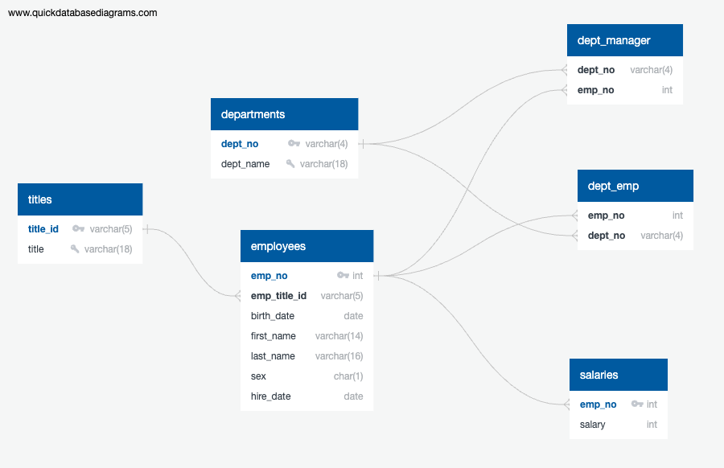

# HR Database Project

This project demonstrates my skills in data analysis and database management through a comprehensive ETL process. I analyzed HR data from multiple CSV files, designed and implemented a relational database schema, and executed SQL queries to extract insights. This project highlights my ability to work with complex datasets, develop efficient data models, and perform SQL-based data analysis—skills essential for a data analyst role.

## Project Overview

The primary objective of this project was to load, clean, and structure HR data into a PostgreSQL database. This database enables querying and analysis, simulating a real-world ETL pipeline to prepare data for analytics. Below is an overview of the project components and the process followed to build the HR database.

### File Structure

- **DataExploration.ipynb**: Loads CSV data from the `data` directory, suggests data models based on column attributes, and generates a data model diagram using [QuickDatabaseDiagrams.com](https://quickdatabasediagrams.com/).
- **table_schemata.sql**: Contains the SQL schema for table creation, including data types and constraints. Data can be imported into PostgreSQL using the Import function.
- **data_analysis.sql**: Contains all SQL queries for data analysis, including complex joins and aggregations to answer key questions about the dataset.
- **Raw_Data/**: Directory containing all CSV files used to populate the database tables.

## Data Model

### Entity-Relationship Diagram (ERD)

The ERD below illustrates the database structure, with relationships between tables clearly defined to support data integrity and optimized queries.

### Data Types and Constraints

- **IDs**: All numerical IDs are cast as `INT`, while non-numerical IDs are cast as `VARCHAR`.
- **Salary**: Defined as `INT`, as no decimal values are present in the dataset.
- **Character Fields**: `CHAR(1)` is used for binary fields such as employee gender.
- **Dates**: Initially imported as `VARCHAR(10)`, dates are converted to `DATE` format (MM/DD/YYYY) for easier date-based queries and ordering. This format is more suitable for real-world data analysis and simplifies chronological operations.
- **Variable-Length Strings**: `VARCHAR` length is determined based on the maximum string length for each field in the dataset. This choice ensures consistency with the data provided, but could be adjusted with a margin in a production environment to accommodate longer strings.

### Special Considerations

1. **Date Conversion**: Birth and hire dates are converted from `VARCHAR(10)` to `DATE` using PostgreSQL’s `TO_DATE()` function. This simplifies date manipulation and enhances query performance, especially for chronological sorting.

2. **NOT NULL Conditions**: Certain columns allow for `NULL` values:
   - **titles.title**: This field may be left blank for employees awaiting a title change or for undefined titles.
   - **employees.sex**: Gender can be unspecified.
   - **salaries.salary**: A salary can be left blank during negotiations or for unpaid roles.

3. **Composite Keys**: For tables where primary keys are not feasible due to non-unique values (e.g., `dept_emp` and `dept_manager`), composite keys combining columns or `SERIAL` IDs were considered. However, since these are junction tables, composite keys were not implemented to avoid adding unnecessary complexity.

## Key SQL Queries

The `data_analysis.sql` file contains queries that address various HR-related questions, such as:
- Employee details, including name, gender, and salary.
- Date-based queries, such as employees hired in a specific year.
- Departmental queries, linking employees to their departments and managers.
- Name-based queries, filtering employees based on name patterns.
- Aggregation queries, such as frequency counts of last names.

These queries demonstrate my proficiency in SQL, particularly in joins, date manipulation, and aggregations.

## Skills Demonstrated

This project showcases several key skills relevant to data analysis and ETL development:

- **Data Modeling and Database Design**: Created a normalized relational model to store HR data efficiently.
- **Data Cleaning and Transformation**: Used PostgreSQL functions to convert data types, handle NULL values, and optimize data for analysis.
- **SQL Querying and Analysis**: Developed complex SQL queries to extract insights from structured HR data, showcasing my ability to derive value from data.
- **Attention to Data Constraints**: Accounted for primary keys, foreign keys, and NULL constraints to ensure data integrity within the relational model.

## Conclusion

This project provides a comprehensive demonstration of the ETL process, from data import and transformation to database schema design and SQL-based analysis. By creating this HR database, I have developed a strong foundation in data modeling, query optimization, and data integrity management—skills essential for a data analyst role.
